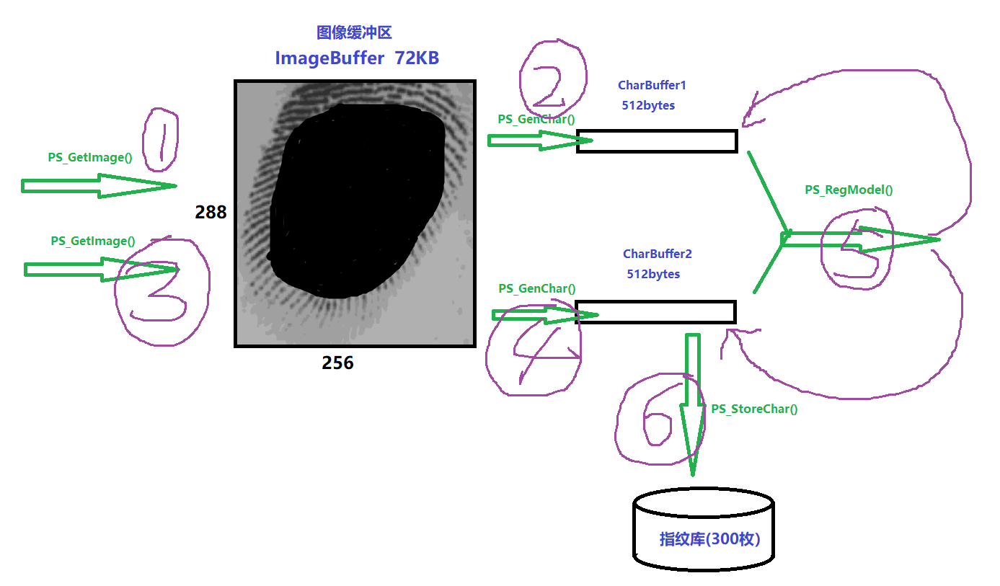
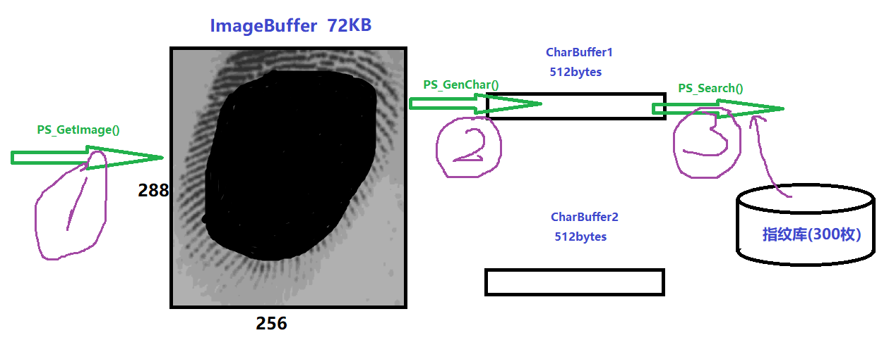
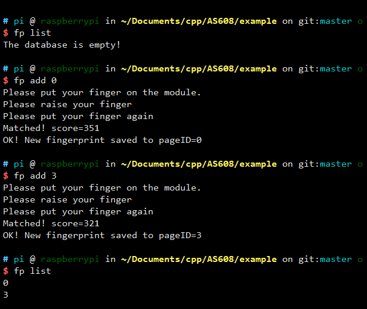
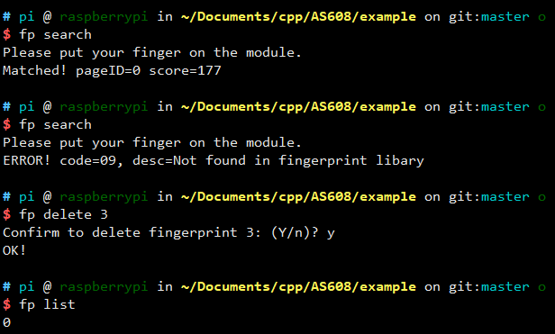

# Origin Project Path
[Leopard-C / AS608](https://github.com/Leopard-C/AS608)

--- 

라즈베리 파이에 AS608 모듈을 사용하여 이 프로젝트는 모든 공식 사용자 개발 매뉴얼에 나열된 기능을 구현했으며 함수 선언은 'as608.h`에 나와 있습니다. 사용자는 AS608 모듈과 통신하기 위해 해당 함수를 직접 호출할 수 있습니다.

또한 프로젝트에는 터미널 아래에서 명령을 통해 모듈과 상호 작용할 수 있는 명령줄 프로그램이 있습니다.

## 1. AS608

### 1. 소개

데이터는 300개의 지문 용량으로 모듈에 저장됩니다.

이 칩에는 72K 바이트의 이미지 버퍼와 512 bytes(256 워드) 크기의 두 개의 피쳐 파일이 있습니다. 버퍼 이름은 각각 `ImageBuffer`, `CharBuffer1`, `CharBuffer2`입니다.사용자가 손가락으로 가리킬 수 있습니다.

임의의 버퍼를 읽고 쓰도록 명령합니다.`CharBuffer1`이나 `CharBuffer2`는 일반 피처 파일 저장에도 사용할 수 있습니다.

템플릿 특성 파일을 저장하는 데 사용할 수 있습니다.

### 2. 작업 프로세스

지문 입력 프로세스 :



지문 검색 프로세스：


 
AS608 모듈 내부에 손가락 감지 회로가 내장되어 있어 사용자가 상태 핀(WAK)을 읽고 손가락 누름 여부를 판단할 수 있습니다.

본 프로젝트에서,`as608.h`의 전역변수 `g_detect_pin`은 이 핀이 라즈베리 파이에 연결된 GPIO 포트를 나타냅니다.
 
(<font color="red">주의: 핀 인코딩 방식은 `wiringPi` 인코딩입니다</font>)


이 핀의 입력 신호를 읽습니다. HIGH는 모듈에 손가락이 있음을 의미합니다. LOW라면 손가랍이 존재하지 않음을 의미합니다. 몇 초를 기다린 후 손가락이 계속 감지되지 않으면 오류를 보고합니다.

### 3. 칩 주소와 비밀번호
   
기본 주소는 `0xffffff`이고 기본 비밀번호는 `0x000000`입니다. 다른 비밀번호를 설정하지 않으면 모듈에 비밀번호를 확인할 필요가 없습니다. 그렇지 않으면 모듈과 통신하는 첫 번째 명령은 비밀번호 `PS_VfyPwd( )`를 확인해야 합니다.

## 2. 항목-함수 라이브러리
   
이 항목의 루트 디렉터리에 있는 `as608.h`와`as608.c`는 당신의 프로젝트 폴더에 복사하면 됩니다.

### 1. 구조체

```C++
// typedef unsigned int uint;

typedef struct AS608_Module_Info {
  uint status;      // 상태 레지스터 0
  uint model;       // 센서 유형 0-15
  uint capacity;    // 지문 용량，300
  uint secure_level;    // 보안 수준 1/2/3/4/5，기본값은 3
  uint packet_size;     // 데이터 패킷 크기 32/64/128/256 bytes，기본값은 128
  uint baud_rate;       // 보율 
  uint chip_addr;       // 장치(칩)주소                  
  uint password;        // 통신 비밀번호
  char product_sn[12];        // 제품 모델명
  char software_version[12];  // 소프트웨어 버전
  char manufacture[12];       // 제조사 명
  char sensor_name[12];       // 센서 이름

  uint detect_pin;      // AS608의 WAK 핀으로 연결된 라즈베리 파이 GPIO 핀
  uint has_password;    // 암호 있는지 여부
} AS608;

extern AS608 g_as608;
```

### 2. 전역변수
라즈베리 파이 하드웨어를 사용하여 직렬 통신을 하려면 추가 설정을 해야 합니다. (온보드 블루투스 기능 끄기 등)   
참고 - <a href="https://blog.csdn.net/guet_gjl/article/details/85164072" target="_blank">CSDN-라즈베리 파이, 시리얼 포트를 이용한 통신.</a>

+ `int g_fd`：시리얼 포트의 파일 기술자.

```C
g_fd = serialOpen("/dev/ttyAMA0", 9600);  // 전송속도: 9600
```


+ `int g_verbose`：실행 중 화면에 출력되는 정보의 양

`0`이면 거의 표시되지 않음. 패킷을 전송할 때 진행 표시줄이 출력됩니다.
   
`1`이면 보낸 명령어 패킷의 내용과 받은 명령어 패킷의 내용 등 상세 정보가 표기됩니다.

`기타` 수치라면 아무런 정보도 표시되지 않습니다.


+ `int g_error_code`：모듈이 반환한 오류 코드나 사용자 정의 오류 코드

+ `char g_error_desc[128]`： 오류코드의 의미. `char* PS_GetErrorDesc()` 함수로 얻을 수 있습니다.

### 3. 함수
 
`as608.c`의 각 함수에 상세한 주석이 있습니다.

### 4. 사용법

이 항목의 루트 디렉터리에 있는 `as608.h`와 `as608.c`는 당신의 프로그램 목록 아래에 복사되고 헤드파일이 포함되어 있습니다.

`<wiringPi.h>`와 `<wiringSerial.h>`을 include 해야합니다.

기초 사용법은 다음과 같습니다：

```C
#include <stdio.h>
#include <wiringPi.h>
#include <wiringSerial.h>
#include "as608.h"			// 헤더파일 포함

// 전역변수를 선언합니다.【as608.c에서 정의됨】
extern AS608 g_as608;
extern int g_fd;
extern int g_verbose;
extern char  g_error_desc[];
extern uchar g_error_code;

int main() {
    // 전역변수에 값 할당
    g_as608.detect_pin = 1; 
    g_as608.has_password = 0;  // 비밀번호 없음
    g_verbose = 0;       // 출력정보를 최소화 합니다
    
    // wiringPi 초기화
    if (-1 == wiringPiSetup())
        return 1;
    
    // g_detect_pin 핀을 입력 모드로 설정합니다
    pinMode(g_as608.detect_pin, INPUT);
    
    // 시리얼 포트 열기
    if ((g_fd = serialOpen("/dev/ttyAMA0", 9600)) < 0)
        return 2;
    
    // AS608 모듈 초기화
    if (PS_Setup(0xfffffff, 0x00000000) == 0)
        return 3;
    
    /****************************************/
    
    // do something
    
    /****************************************/
    
    // 시리얼 포트 닫기
    serialClose(g_fd);
    
    return 0;
}
```

손가락 감지

AS608은 저항 스크린을 사용하여 `WAK` 핀의 레벨을 감지하여 모듈에 손가락이 있는지 여부를 판단할 수 있습니다.


- 손가락 감지
```C
// as608.h에 래퍼함수가 있습니다.
// 손가락을 감지하면 true를 반환하고, 그렇지 않으면 false를 반환합니다.
// g_as608.detect_pin, 즉 AS608의 WAK 핀이 구성되어있다 가정합니다.
bool PS_DetectFinger();
```

`exanmple/main.c`에는 두 개의 함수가 있습니다.

```C++
// 손가락이 감지될때까지 대기합니다.
// 최대 wait_time ms
bool waitUntilDetectFinger(int wait_time) {
	while (true) {
		if (PS_DetectFinger())
			return true;
		else {
			delay(100);
			wait_time -= 100;
			if (wait_time < 0)
				return false;
		}
	}
}

// 손가락이 감지되지 않을때까지 대기합니다.
// 최대 wait_time ms
bool waitUntilNotDetectFinger(int wait_time) {
  while (true) {
    if (!PS_DetectFinger()) {
      return true;
    }
    else {
      delay(100);
      wait_time -= 100;
      if (wait_time < 0) {
        return false;
      }
    }
  }
}
```

- 지문 등록

```C
bool newFingerprint(int pageID) {
	printf("Please put your finger on the module.\n");
	if (waitUntilDetectFinger(5000)) {
		delay(500);
		PS_GetImage();
		PS_GenChar(1);
	}
	else {
		printf("Error: Didn't detect finger!\n");
		exit(1);
	}

	// 사용자가 손가락을 들었는지 확인
	printf("Ok.\nPlease raise your finger!\n");
	if (waitUntilNotDetectFinger(5000)) {
		delay(100);
		printf("Ok.\nPlease put your finger again!\n");
		// 지문을 한번 더 인식
		if (waitUntilDetectFinger(5000)) {
			delay(500);
			PS_GetImage();
			PS_GenChar(2);
		}
		else {
			printf("Error: Didn't detect finger!\n");
			exit(1);
		}
	}
	else {
		printf("Error! Didn't raise your finger\n");
		exit(1);
	}

	int score = 0;
	if (PS_Match(&score)) {
		printf("Matched! score=%d\n", score);
	}
	else {
		printf("Not matched, raise your finger and put it on again.\n");
		exit(1);
	}

	// 피처 파일 병합
	PS_RegModel();
	PS_StoreChar(2, pageID);

	printf("OK! New fingerprint saved to pageID=%d\n", pageID);
}
```

## 3. Command Line Program

### 1. 컴파일 및 실행

```bash
cd example
make
./fp  # 처음 사용 시 프로그램 초기화
alias fp=./fp # 앞으로 "./" 접두사 업이 fp를 사용할 수 있습니다.
```

### 2. config 파일 수정

방법 1：`~/.fpconfig` 파일 편집   
`vim ~/.fpconfig`이나 `namo ~/.fpconfig`, 즉 텍스트 편집기로 수정

```
address=0xffffffff
password=none
baudrate=9600
detect_pin=1
serial=/dev/ttyAMA0
```

방법 2: 명령어 사용

+ `fp cfgaddr [address]` ：address 수정
+ `fp cfgpwd [password] `：password 수정
+ `fp cfgserial [serialFile]`：시리얼 포트 수정
+ `fp cfgbaud [baudrate]`：통신 보율 수정
+ `fp cfgpin [GPIO_pin]`：손가락 감지용 GPIO 핀 수정

### 3. 사용 방법

`fp -h` ：도움말 표시

```text
A command line program to interact with AS608 module.

Usage:
  ./fp [command] [param] [option]

Available Commands:
-------------------------------------------------------------------------
  command  | param     | description
-------------------------------------------------------------------------
  cfgaddr   [addr]     Config address in local config file
  cfgpwd    [pwd]      Config password in local config file
  cfgserial [serialFile] Config serial port in local config file. Default:/dev/ttyAMA0
  cfgbaud   [rate]     Config baud rate in local config file
  cfgpin    [GPIO_pin] Config GPIO pin to detect finger in local confilg file

  add       [pID]      Add a new fingerprint to database. (Read twice) 
  enroll    []         Add a new fingerprint to database. (Read only once)
  delete    [pID {count}]  Delete one or contiguous fingerprints.
  empty     []         Empty the database.
  search    []         Collect fingerprint and search in database.
  identify  []         Search
  count     []         Get the count of registered fingerprints.
  list      []         Show the registered fingerprints list.
  info      []         Show the basic parameters of the module.
  random    []         Generate a random number.(0~2^32)

  getimage  []         Collect a fingerprint and store to ImageBuffer.
  upimage   [filename] Download finger image to ras-pi in ImageBuffer of the module
  downimage [filename] Upload finger image to module
  genchar   [cID]      Generate fingerprint feature from ImageBuffer.
  match     []         Accurate comparison of CharBuffer1 and CharBuffer2
                         feature files.
  regmodel  []         Merge the characteristic file in CharBuffer1 and
                         CharBuffer2 and then generate the template, the
                         results are stored in CharBuffer1 and CharBuffer2.
  storechar [cID pID]  Save the template file in CharBuffer1 or CharBuffer2
                         to the flash database location with the PageID number
  loadchar  [cID pID]  Reads the fingerprint template with the ID specified
                         in the flash database into the template buffer,
                         CharBuffer1 or CharBuffer2
  readinf   [filename] Read the FLASH Info Page (512bytes), and save to file
  writenote     [page {note}]   Write note loacted in pageID=page
  readnote      [page]          Read note loacted in pageID=page
  upchar        [cID filename]  Download feature file in CharBufferID to ras-pi
  downchar      [cID filename]  Upload feature file in loacl disk to module
  setpwd        [pwd]           Set password
  vfypwd        [pwd]           Verify password
  packetsize    [{size}]        Show or Set data packet size
  baudrate      [{rate}]        Show or Set baud rate
  level         [{level}]       Show or Set secure level(1~5)
  address       [{addr}]        Show or Set secure level(1~5)

Avaiable options:
  -h    Show help
  -v    Shwo details while excute the order

Usage:
  ./fp [command] [param] [option]

```

**참고사항**

+ `-v` 또는 `-h` 옵션은 <font color="red">반드시 명령어 맨 뒤에 입력해야합니다</font>. 그렇지 않으면 오류가 발생할 수 있습니다.
+ `[]`는 명령어의 매개변수를 나타내며, `{}`는 선택사항을 나타냅니다.

### 4. 예제

- 지문 등록
```bash
# 지문 등록(두 번 읽기)하고 지문 라이브러리의 7번 위치에 저장합니다.
fp add 7
# 지문 등록(한 번 읽기)하고 저장된 위치 ID를 반환합니다.
fp enroll
```

- 지문 삭제
```bash
# 지문 라이브러리에서 5번째 지문 삭제
fp delete 5
# 지문 라이브러리에서 0부터 19까지의 지문(총 20개) 삭제
fp delete 0 20
```

- 지문 비교
```bash
# 지문 수집 및 비교, 다음 3가지 명령 모두 사용 가능합니다.
fp search
fp hsearch  # high speed search
fp identity
```

- 지문 리스트 반환
```bash
# 지문 라이브러리에 등록된 지문 ID 나열
fp list
```

- 칩 주소
```bash
# 현재 칩 주소 표시
fp address
# 칩 주소를 0xefefefef로 설정
fp address 0xefefefef  # 접두사 0x는 생략 가능합니다.
```

- 비밀번호 설정
```bash
# 비밀번호를 0xcc0825cc로 설정
fp setpwd 0xcc0825cc
```

【아래 그림은 실제 실행 결과를 기준으로 하며 차이가 있을 수 있습니다.】





## 참고

.fpconfig 파일은 사용자의 HOME 디렉터리에 생성됩니다. 이에 유의해주세요.

`sudo ./fp <command>`를 사용할 경우 HOME 디렉터리가 아닌 ROOT 디렉터리에 .fpconfig 파일이 생성됩니다.


## END

<leopard.c@outlook.com>